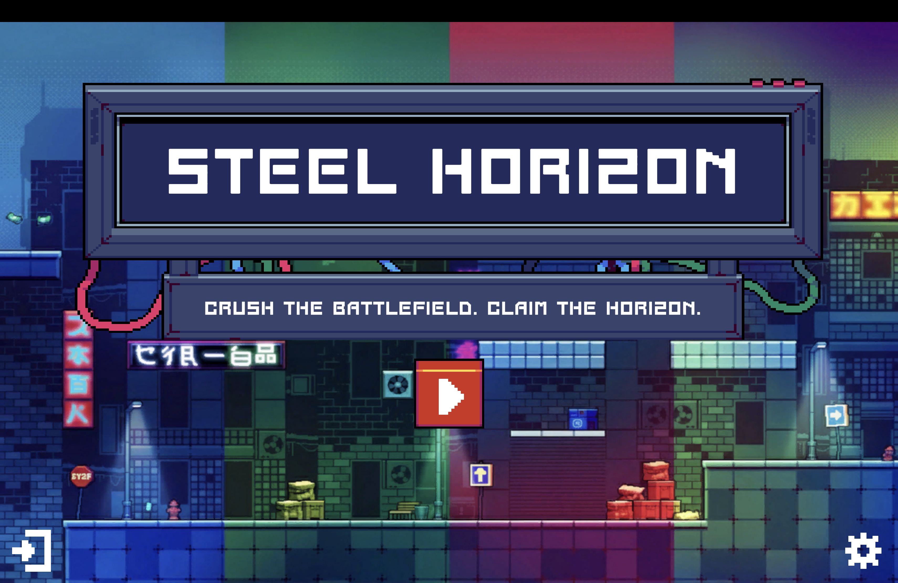
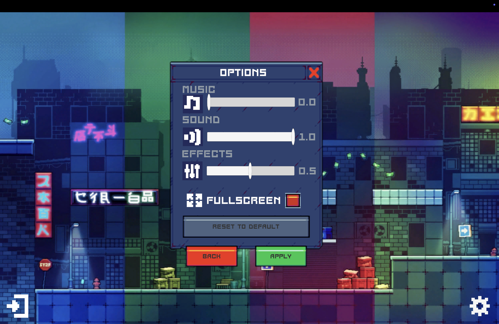
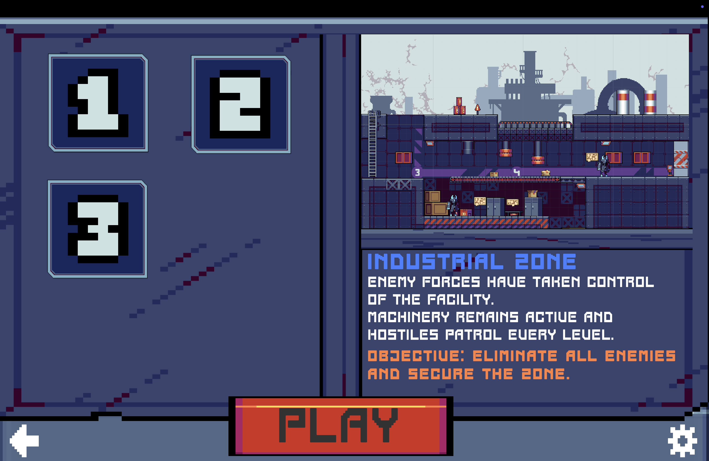
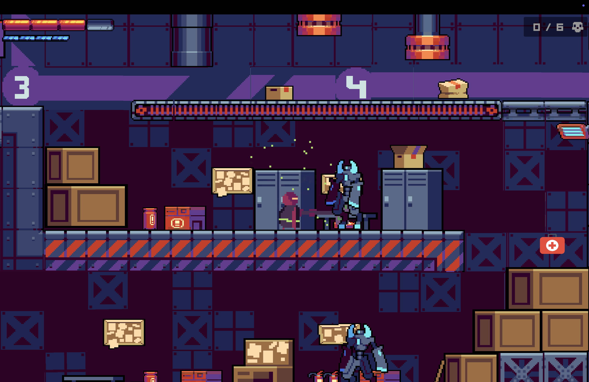
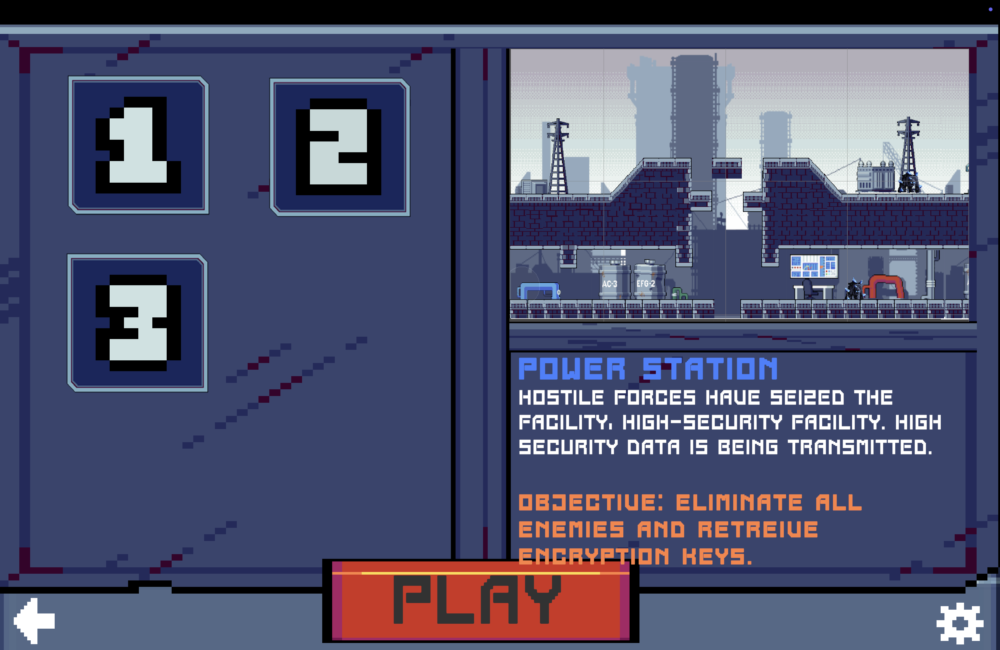
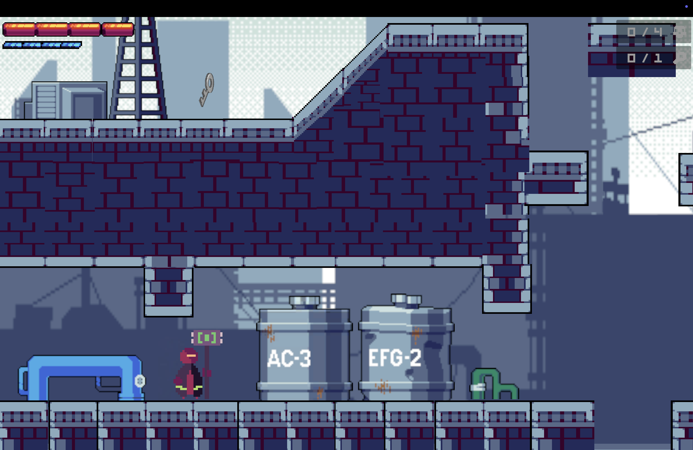
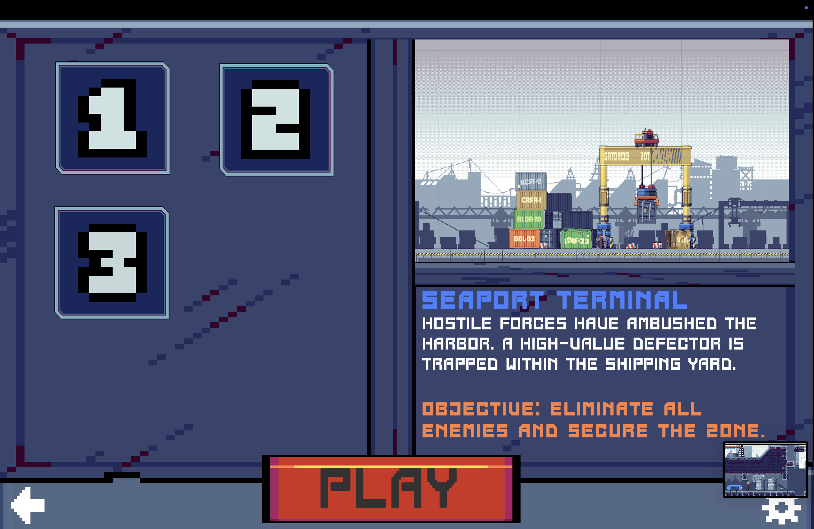
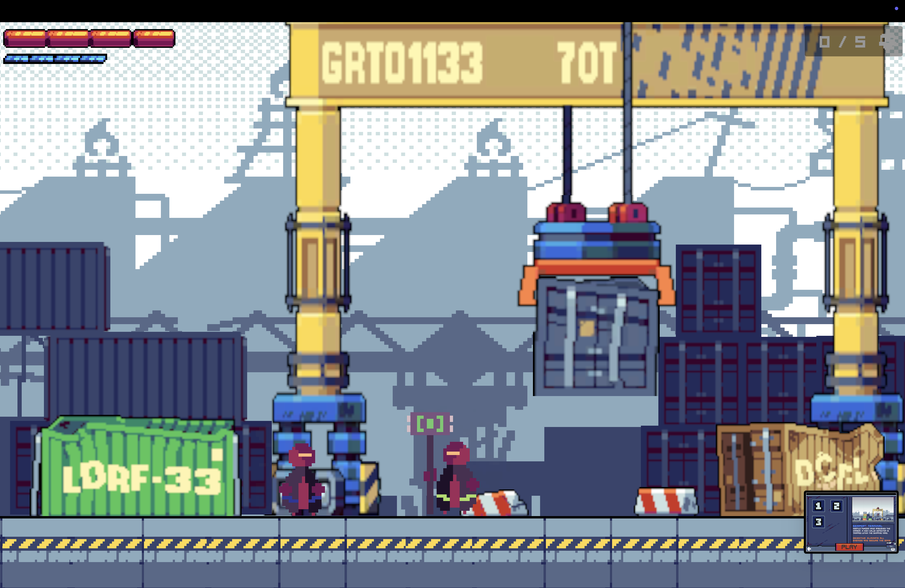
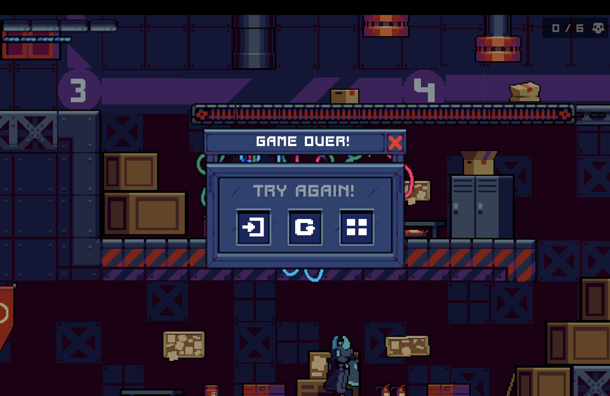
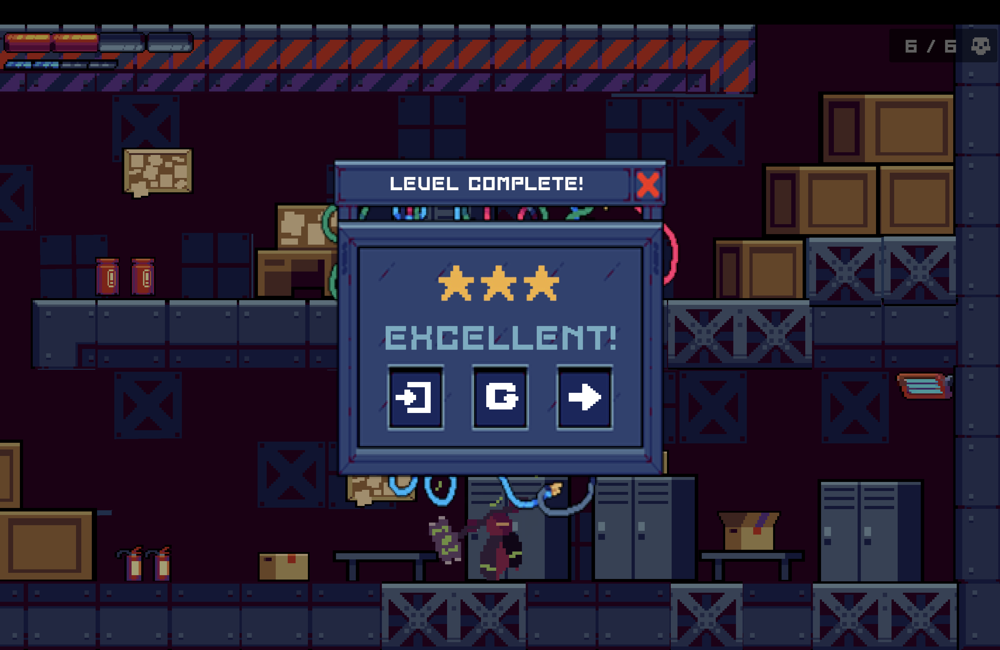

# Steel Horizon - Platformer 2D (Unity)

## 1. Introduction

**Steel Horizon** is an interactive video game application, developed using the Unity graphics engine and the C# programming language. The project aims to demonstrate skills in object-oriented software development, real-time physics management, and user interface (UI) design.

### 1.1 Objective
The main goal of the player is to complete a series of levels of increasing difficulty. To complete a level, the user must fulfill two strategic objectives:
1. Neutralize all enemies present in the scene.
2. Recover the keys distributed or protect the target in the level.

## 2. Software Architecture
The system is built on a modular architecture, using object-oriented programming (OOP) principles, especially **Inheritance** and **Polymorphism**, to ensure clean and extensible code.

### 2.1 Class Hierarchy (Entity System)
The core of the interaction is the abstract `Entity` class, which defines the fundamental behavior of any being in the game.

**`Entity` (Base Class)**
* *Responsibilities*: Handles the core Unity components (`Rigidbody2D` for physics, `Animator` for animations), ground collision detection, and health.
* *Key Methods*: `Damage()`, `Die()`, `HandleMovement()`, `HandleCollision()`.
* **`Player` (Extends `Entity`)**
* *Functionality*: Implements the logic specific to human control.
* *Input System*: Processes keyboard input for horizontal movement, jumping, and attacks.
* *UI Binding*: Updates the HUD (heart count and health bar) in real time.
* **`Enemy` (Extends `Entity`)**
* *Functionality*: Defines the basic behavior of enemies (player detection).
* **`EnemyPatrol` (Extends `Enemy`)**
* *Advanced AI*: Implements a simplified Finite State Machine (FSM):
    1. **Patrol**: Move between two points (`leftEdge`, `rightEdge`).
    2. **Idle**: Pause at the ends of the patrol route.
    3. **Chase**: When the player enters the visual range (`chaseRange`), the enemy leaves its route to attack.

### 2.2 Design Patterns Used
1. **Singleton**: Used for global managers that need to exist in a single instance and be accessible from anywhere.
    * `ObjectiveManager.instance`: Centralizes game state (score, remaining enemies).
    * `PauseMenu.instance`: Controls pause state and UI panels.
    * `SceneController.instance`: Manages transitions between scenes.
## 3. Technical Implementation and Gameplay

### 3.1 Combat System and Resources
* **Health**: Implemented by `currentHealth`. It decreases with each hit. If it reaches 0, the entity calls `Die()`. Healing is done by `HealthPack`, which calls the `Heal()` method of `Player`.
* **Energy**: Managed exclusively in the `Player` class.
    * *Regeneration*: `RegenerateEnergy()` increases the value over time (`Time.deltaTime`).
    * *Special Attack*: The `HandleSuperAttack()` method checks if the energy is maximum, triggers the animation, and then drains the energy in steps using a coroutine (`IEnumerator StepDrainEnergy`).

### 3.2 Artificial Intelligence (Enemy AI)
The `EnemyPatrol.cs` script contains the detection logic.
*   **Player Detection**: Uses `Physics2D.OverlapCircle` to check for the presence of the player within a defined radius.
*   **Tracking Logic**: If the player is detected, the enemy calculates the direction (`target.position.x - transform.position.x`) and moves towards it. The platform boundaries are checked to prevent the enemy from falling.

### 3.3 Environmental elements
* **Moving Platforms**: The `MovingPlatforms.cs` script moves the platform between a series of points.
    * *Parenting*: When the player touches the platform (`OnCollisionEnter2D`), it becomes the "child" of the platform's transform. This ensures that the player moves with the platform and does not slide.

## 4. User Interface

The interface is built using Unity's UI system (Canvas).

### 4.1 Main Menu
* Includes options for **Volume** (Master, Music, SFX) connected to an `AudioMixer`.
* Option for **Full Screen / Window**.
* Uses `PlayerPrefs` to save user preferences between sessions.

### 4.2 HUD (Heads-Up Display)
* **Hearts**: The `Player` script updates an array of images (`Image[] heartImages`), switching sprites between "Full Heart" and "Empty Heart" depending on the current health.
* **Energy**: Similarly, a segmented bar that fills/empties.
* **Counters**: `ObjectiveManager` updates text for enemies (e.g. "3/5") and keys.

### 4.3 Contextual Menus
The game handles multiple overlapping panels, controlled by `PauseMenu.cs`:
* **Game Over**: Triggered when the player dies. Stops time (`Time.timeScale = 0`).
* **Level Complete**: Triggered by `ObjectiveManager` when objectives are achieved.
* **Pause**: Triggered when the `ESC` key is pressed.
## 5. Instrucțiuni de Utilizare (Ghidul Jucătorului)

### Controls
| Action | Key / Input | Description |
| :--- | :--- | :--- |
| **Move** | `A` / `D` | Move left/right |
| **Jump** | `Space` | Vertical jump |
| **Attack** | `Left Click` | Simple sword strike |
| **Special Attack** | `Shift` + `Click` | Powerful strike (Full energy only) |
| **Pause** | `ESC` | Open pause menu |

### Game Flow
1. Start from **Main Menu** -> Select Level.
2. Explore the level, avoid traps and enemies.
3. Killing enemies increases the Kills counter.
4. Collecting keys unlocks the ending.
5. Upon completion, the next level is unlocked (progress saved via `PlayerPrefs`).

## 6. Conclusions
The "2D Platformer" project represents a complete implementation of a game cycle, integrating physics mechanics, reactive artificial intelligence, and a robust state management system (UI and saved data). The code structure allows for easy addition of new enemies, levels, or mechanics without changing the core systems.
